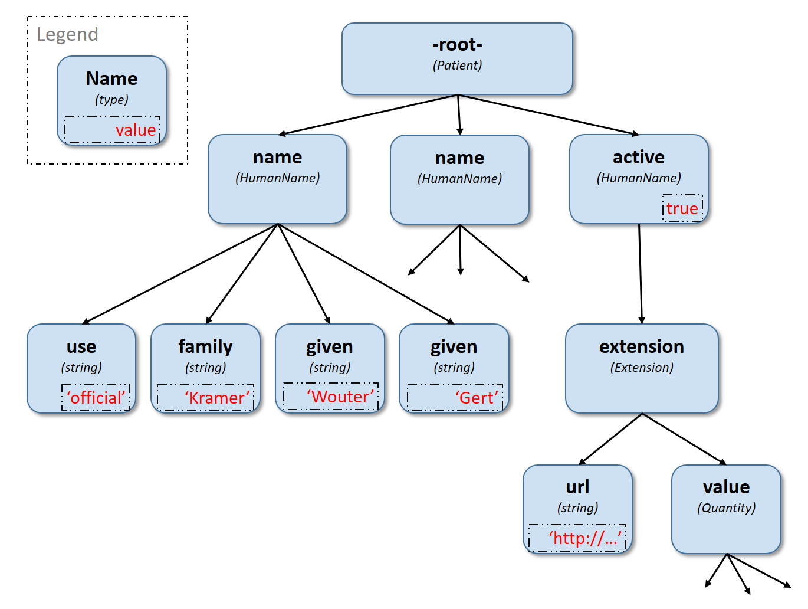

= FluentPath (STU1 Ballot)
:page-layout: current
:sectnums:
:toc: macro

FluentPath is a path based navigation and extraction language, somewhat like XPath. Operations are expressed in terms of the logical content of hierarchical data models, and support traversal, selection and filtering of data. Its design was influenced by the needs for path navigation, selection and formulation of invariants in both HL7 Fast Healthcare Interoperability Resources (FHIR) and HL7 Clinical Quality Language (CQL).

Version: 0.3 Public Domain (Creative Commons 0)

toc::[]

== Overview

In Information Systems in general, and Healthcare Information Systems in particular, the need for formal representation of logic is both pervasive and critical. From low-level technical specifications, through intermediate logical architectures, up to the high-level conceptual descriptions of requirements and behavior, the ability to formally represent knowledge in terms of expressions and information models is essential to the specification and implementation of these systems.

=== Requirements

Of particular importance is the ability to easily and precisely express conditions of basic logic, such as those found in requirements constraints (e.g. Patients must have a name), decision support (e.g. if the patient has diabetes and has not had a recent comprehensive foot exam), cohort definitions (e.g. All male patients aged 60-75), protocol descriptions (e.g. if the specimen has tested positive for the presence of sodium), and numerous other environments.

Precisely because the need for such expressions is so pervasive, there is no shortage of existing languages for representing them. However, these languages tend to be tightly coupled to the data structures, and even the information models on which they operate, XPath being a typical example. To ensure that the knowledge captured by the representation of these expressions can survive technological drift, a representation that can be used independent of any underlying physical implementation and information model is required.

Languages meeting these additional requirements also exist, such as Java, JavaScript, C#, and others. However, these languages are both tightly coupled to the platforms in which they operate, and, because they are general-purpose development languages, come with much heavier tooling and technology dependencies than is warranted or desirable.

Given these constraints, and the lack of a specific language that meets all of these requirements, there is a need for a simple, lightweight, platform- and structure-independent graph traversal language. FluentPath meets these requirements, and can be used within various environments to provide for simple but effective formal representation of expressions.

=== Features

* Graph-traversal: FluentPath is a graph-traversal language; authors can clearly and concisely express graph traversal on hierarchical information models (e.g. HL7 V3, FHIR, vMR, CIMI, and QDM).
* Collection-centric: FluentPath deals with all values as collections, allowing it to easily deal with information models with repeating elements.
* Platform-independent: FluentPath is a conceptual and logical specification that can be implemented in any platform.
* Model-independent: FluentPath deals with data as an abstract model, allowing it to be used with any information model.

=== Usage

In Fast Healthcare Interoperability Resources (FHIR), FluentPath is used within the specification to provide formal definitions for conditions such as validation invariants, search parameter paths, etc. Within Clinical Quality Language (CQL), FluentPath is used to simplify graph-traversal for hierarchical information models.

In both FHIR and CQL, the model independence of FluentPath means that expressions can be written that deal with the contents of the resources and data types as described in the Logical views, or the UML diagrams, rather than against the physical representation of those resources. JSON and XML specific features are not visible to the FluentPath language (such as comments and the split representation of primitives (i.e. `value[x]`)).

The expressions can in theory be converted to equivalent expressions in XPath, OCL, or another similarly expressive language.

=== Conventions

Throughout this documentation, `monospace font` is used to delineate expressions of FluentPath.

== Navigation model

FluentPath navigates and selects nodes from a tree that abstracts away and is independent of the actual underlying implementation of the source against which the FluentPath query is run. This way, FluentPath can be used on in-memory Java POJOs, Xml data or any other physical representation, so long as that representation can be viewed as classes that have properties. In somewhat more formal terms, FluentPath operates on a directed acyclic graph of classes as defined by a MOF-equivalent type system.

Data is represented as a tree of labelled nodes, where each node may optionally carry a primitive value and have child nodes. Nodes need not have a unique label, and leaf nodes must carry a primitive value. For example, a (partial) representation of a FHIR Patient resource in this model looks like this:

The diagram shows a tree with a repeating `name` node, which represents repeating members of the FHIR object model. Leaf nodes such as `use` and `family` carry a (string) value. It is also possible for internal nodes to carry a value, as is the case for the node labelled `active`: this allows the tree to represent FHIR "primitives", which may still have child extension data.

== Path selection

FluentPath allows navigation through the tree by composing a path of concatenated labels, e.g.

[source]
----
name.given
----

This would result in a collection of nodes, one with the value "Wouter" and one with the value "Gert". In fact, each step in such a path results in a collection of nodes by selecting nodes with the given label from the step before it. The focus at the beginning of the evaluation contained all elements from Patient, and the path `name` selected just those named `name`. Since the `name` element repeats, the next step `given` along the path, will contain all nodes labeled `given` from all nodes `name` in the preceding step. 

The path may start with the type of the root node (which otherwise does not have a name), but this is optional. To illustrate this point, the path `name.given` above can be evaluated as an expression on a set of data of any type. However the expression may be prefixed with the name of the type of the root:

[source]
----
Patient.name.given
----

The two expressions have the same outcome, but when evaluating the second, the evaluation will only produce results when used on data of type `Patient`.

Syntactically, FluentPath defines identifiers as any sequence of characters consisting only of letters, digits, and underscores, beginning with a letter or underscore. Paths may use double quotes to include characters in path parts that would otherwise be interpreted as keywords or operators, e.g.:

[source]
----
Message."PID-1"
----

=== Collections

Collections are fundamental to FluentPath, in that the result of every expression is a collection, even if that expression only results in a single element. This approach allows paths to be specified without having to care about the cardinality of any particular element, and is therefore ideally suited to graph traversal.

Within FluentPath, a collection is:

* Ordered - The order of items in the collection is important and is preserved through operations as much as possible.
* Non-Unique - Duplicate elements are allowed within a collection. Some functions, such as `distinct()` and `union()` produce collections of unique elements, but in general, duplicate elements are allowed.
* Indexed - Each item in a collection can be uniquely addressed by it's index, i.e. ordinal position within the collection
* Countable - The number of items in a given collection can always be determined using the `count()` function
* 0-based - The first item in a collection has index 0

=== Paths and polymorphic items

In the underlying representation of data, nodes may be typed and represent polymorphic items. Paths may either ignore the type of a node, and continue along the path or may be explicit about the expected node and filter the set of nodes by type before navigating down child nodes: 

[source]
----
Observation.value.unit - all kinds of value 
Observation.value.as(Quantity).unit - only values that are of type Quantity
----

The `is` function can be used to determine whether or not a given value is of a given type:

[source]
----
Observation.value.is(Quantity) - returns true if the value is of type Quantity
----

The list of available types that can be passed as a parameter to the `as` and `is` functions is determined by the underlying data model.

=== Referring to the current item

It is sometimes useful to refer to the current item under evaluation when writing an expression, especially within operations like `where()` when the value of the current item needs to be passed as a function parameter. This can be done using the special path `$this`:

[source]
----
Patient.name.given.where(substring($this.length()-3)) = "out"
----

=== Order nodes and traversal

Collections in FluentPath are inherently ordered, and implementations must retain the original order of a collection. There are two special cases: the outcome of operations like `children()` and `descendants()` cannot be assumed to be in any meaningful order, and `first()`, `last()`, `tail()`, `skip()` and `take()` should not be used on collections derived from these paths. Note that some implementations may follow the logical order implied by the data model, and some may not, and some may be different depending on the underlying source.

== Expressions

=== Literals

In addition to paths, FluentPath expressions may contain _literals_ and _function invocations_. FluentPath supports the following types of literals:

[source]
----
boolean: true, false
string: 'test string', 'urn:oid:3.4.5.6.7.8'
integer: 0, 45
decimal: 0.0, 3.141592653587793236
datetime: @2015-02-04T14:34:28Z (`@` followed by ISO8601 compliant date/time)
time: @T14:34:28+09:00 (`@` followed by ISO8601 compliant time beginning with `T`)
quantity: 10 'mg', 4 days
----

==== string

Unicode is supported in both string literals and quoted identifiers. String literals are surrounded by single quotes and may use `\`-escapes to escape quotes and represent Unicode characters:

* Unicode characters may be escaped using `\u` followed by four hex digits.
* Additional escapes are those supported in JSON:
** `\\` (backslash),
** `\/` (slash),
** `\f` (form feed - \u000c),
** `\n` (newline - \u000a),
** `\r` (carriage return - \u000d),
** `\t` (tab - \u0009)
** `\&quot;` (double quote)
** `\&#39;` (single quote)

==== decimal

Decimals cannot use exponential notation.

==== datetime

`datetime` uses a subset of ISO8601:

* It used the YYYY-MM-DD format, though month and days may be left out
* Week dates and ordinal dates are not allowed
* Years must be present (–MM-DD is not used)
* Months must be present if a day is present
* The date may be followed by a `time` as described in the next section.
* Consult the formal grammar for more details.

==== time

`time` uses a subset of ISO8601:

* A time begins with a `T`
* Timezone is optional, but if present the notation "±hh:mm" is used (so must include both minutes and hours)
* `Z` is allowed for the zero UTC offset.

Consult the formal grammar for more details. 

==== quantity

`quantity` is a number (integer or decimal), followed by a valid http://unitsofmeasure.org/trac[Unified Code for Units of Measure (UCUM)] unit, expressed as a string, or a date/time unit, plural or singular:

* year, years
* month, months
* week, weeks
* day, days
* hour, hours
* minute, minutes
* second, seconds
* millisecond, milliseconds

=== Operators

Expressions can also contain _operators_, like those for mathematical operations and boolean logic:

[source]
----
Appointment.minutesDuration / 60 > 5
MedicationAdministration.wasNotGiven implies MedicationAdministration.reasonNotGiven.exists()
name.given | name.family // union of given and family names
'sir ' + name.given
----

=== Functions

Finally, FluentPath supports the notion of functions, which all take a collection of values as input and produce another collection as output. For example:

[source]
----
(name.given | name.family).count()
identifier.where(use = 'official')
----

Since all functions work on collections, constants will first be converted to a collection when functions are invoked on constants:

[source]
----
(4+5).count()
----

will return `1`, since this is implicitly a collection with one constant number `9`.

=== Null and empty

There is no concept of `null` in FluentPath. This means that when, in an underlying data object a member is null or missing, there will simply be no corresponding node for that member in the tree, e.g. `Patient.name` will return an empty collection (not null) if there are no name elements in the instance.

In expressions, the empty collection is represented as `{}`.

=== Boolean evaluation of collections

Collections can be evaluated as booleans in logical tests in criteria. When a collection is implicitly converted to a boolean then:

* IF the collection contains a single node AND the node's value is a boolean THEN
* the collection evaluates to the value of that single boolean node
* ELSE IF the collection is empty THEN
* the collection evaluates to an empty collection
* ELSE
* an error is raised

This same principle applies when using the path statement in invariants.

=== Propagation of empty results

FluentPath functions and operators both propagate empty results, but the behavior is in general different when the argument to the function or operator expects a collection (e.g. `select()`, `where()` and `|` (union)) versus when the argument to the function or operator expects singleton value (e.g. `+` and `substring()`).

For functions or operators that expect singleton values, this means in general if the input is empty, then the result will be empty as well. More specifically:

* If a singleton function operates on an empty collection, the result is an empty collection
* If a singleton function is passed an empty collection as an argument, the result is an empty collection
* If any operand to a singleton operator is an empty collection, the result is an empty collection.

For functions or arguments that expect collections, in general the empty collection is treated as any other collection would be. For example, the union (`|`) of an empty collection with a non-empty collection is the non-empty collection.

When functions or operators behave differently from these general principles, (for example the `count()` and `empty()` functions), this is clearly documented in the next sections.

== Functions

Functions are distinguished from path navigation names by the fact that they are followed by a `()` with zero or more parameters. With a few minor exceptions (e.g. the `today()` function), functions in FluentPath always take a collection as input and produce another collection as output, even though these may be collections of just a single item. 

Correspondingly, arguments to the functions can be any FluentPath expression, though singleton functions require these expressions to evaluate to a collection containing a single item of a specific type. This approach allows functions to be chained, successively operating on the results of the previous function in order to produce the desired final result.

The following sections describe the functions supported in FluentPath, detailing the expected types of parameters and type of collection returned by the function:

* If the function expects a parameter to be a single value (e.g. `item(index: integer)` and it is passed an argument that evaluates to a collection with multiple items or a collection with an item that is not of the required type, the evaluation of the expression will end and an error will be signaled to the calling environment.
* If the function takes an `expression` as a parameter, the function will evaluate this parameter with respect to each of the items in the input collection. These expressions may refer to the special `$this` element, which represents the item from the input collection currently under evaluation. For example, in:
`name.given.where($this > 'ba' and $this < 'bc')` the `where()` function will iterate over each item in the input collection (elements named `given`) and `$this` will be set to each item when the expression passed to `where()` is evaluated.
* Optional parameters are enclosed in square brackets in the definition of a function. Note that the brackets are only used to indicate optionality in the signature, they are not part of the actual syntax of FluentPath.
* All functions return a collection, but if the function or operation will always produce a collection containing a single item of a predefined type, the description of the function will specify its output type explicitly, instead of just stating `collection`, e.g. `all(...) : boolean`

=== Existence

==== empty() : boolean

Returns `true` if the input collection is empty (`{ }`) and `false` otherwise.

==== not() : boolean

Returns `true` if the input collection evaluates to `false`, and `false` if it evaluates to `true`. Otherwise, the result is empty (`{ }`):

|===
|&nbsp; |not 

|`true` |`false` 
|`false` |`true` 
|empty (`{ }`) |empty (`{ }`) 
|===

==== exists([criteria : expression]) : boolean

Returns `true` if the collection has any elements, and `false` otherwise. This is the opposite of `empty()`, and as such is a shorthand for `empty().not()`. If the input collection is empty (`{ }`), the result is `false`.

The operator can also take an optional criteria to be applied to the collection prior to the determination of the exists. In this case, the operation is shorthand for `where(criteria).exists()`.

==== all(criteria : expression) : boolean

Returns `true` if for every element in the input collection, `criteria` evaluates to `true`. Otherwise, the result is `false`. If the input collection is empty (`{ }`), the result is `true`.

==== allTrue() : boolean

Takes a collection of boolean values and returns `true` if all the items are `true`. If any items are `false`, the result is `false`. If the input is empty (`{ }`), the result is `true`.

==== anyTrue() : boolean

Takes a collection of boolean values and returns `true` if any of the items are `true`. If all the items are `false`, or if the input is empty (`{ }`), the result is `false`.

==== subsetOf(other : collection) : boolean

Returns `true` if all items in the input collection are members of the collection passed as the `other` argument. Membership is determined using the equals (`=`) operation (see below).

Conceptually, this function is evaluated by testing each element in the input collection for membership in the `other` collection, with a default of `true`. This means that if the input collection is empty (`{ }`), the result is `true`, otherwise if the `other` collection is empty (`{ }`), the result is `false`.

==== supersetOf(other : collection) : boolean

Returns `true` if all items in the collection passed as the `other` argument are members of the input collection. Membership is determined using the equals (`=`) operation (see below).

Conceptually, this function is evaluated by testing each element in the `other` collection for membership in the input collection, with a default of `false`. This means that if the input collection is empty (`{ }`), the result is `false`, otherwise if the `other` collection is empty (`{ }`), the result is `true`.

==== isDistinct() : boolean

Returns `true` if all the items in the input collection are distinct. To determine whether two items are distinct, the equals (`=`) operator is used, as defined below.

Conceptually, this function is shorthand for a comparison of the `count()` of the input collection against the `count()` of the `distinct()` of the input collection:

[source]
----
X.count() = X.distinct().count()
----

This means that if the input collection is empty (`{ }`), the result is true.

==== distinct() : collection

Returns a collection containing only the unique items in the input collection. To determine whether two items are the same, the equals (`=`) operator is used, as defined below.

If the input collection is empty (`{ }`), the result is empty.

==== count() : integer

Returns a collection with a single value which is the integer count of the number of items in the input collection. Returns 0 when the input collection is empty.

=== Filtering and projection

==== where(criteria : expression) : collection

Returns a collection containing only those elements in the input collection for which the stated `criteria` expression evaluates to `true`. Elements for which the expression evaluates to `false` or empty (`{ }`) are not included in the result.

If the input collection is emtpy (`{ }`), the result is empty.

==== select(projection: expression) : collection

Evaluates the `projection` expression for each item in the input collection. The result of each evaluation is added to the output collection. If the evaluation results in a collection with multiple items, all items are added to the output collection (collections resulting from evaluation of `projection` are _flattened_). This means that if the evaluation for an element results in the empty collection (`{ }`), no element is added to the result, and that if the input collection is empty (`{ }`), the result is empty as well.

==== repeat(projection: expression) : collection

A version of `select` that will repeat the `projection` and add it to the output collection, as long as the projection yields new items (as determined by the equals (`=`) operator). 

This operation can be used to traverse a tree and selecting only specific children:

[source]
----
ValueSet.expansion.repeat(contains)
----

Will repeat finding children called `contains`, until no new nodes are found.

[source]
----
Questionnaire.repeat(group | question).question
----

Will repeat finding children called `group` or `question`, until no new nodes are found.

Note that this is slightly different from

[source]
----
Questionnaire.descendants().select(group | question)
----

which would find *any* descendants called `group` or `question`, not just the ones nested inside other `group` or `question` elements.

==== ofType(type : identifier) : collection

Returns a collection that contains all items in the input collection that are of the given type or a subclass thereof. If the input collection is empty (`{ }`), the result is empty.

=== Subsetting

==== [ index : integer ] : collection

The indexer operation returns a collection with only the `index`-th item (0-based index). If the input collection is empty (`{ }`), or the index lies outside the boundaries of the input collection, an empty collection is returned.

Example:

[source]
----
Patient.name[0]
----

==== single() : collection

Will return the single item in the input if there is just one item. If the input collection is empty (`{ }`), the result is empty. If there are multiple items, an error is signaled to the evaluation environment. This operation is useful for ensuring that an error is returned if an assumption about cardinality is violated at run-time.

==== first() : collection

Returns a collection containing only the first item in the input collection. This function is equivalent to `item(0)`, so it will return an empty collection if the input collection has no items.

==== last() : collection

Returns a collection containing only the last item in the input collection. Will return an empty collection if the input collection has no items.

==== tail() : collection

Returns a collection containing all but the first item in the input collection. Will return an empty collection if the input collection has no items, or only one item.

==== skip(num : integer) : collection

Returns a collection containing all but the first `num` items in the input collection. Will return an empty collection if there are no items remaining after the indicated number of items have been skipped, or if the input collection is empty. If `num` is less than or equal to zero, the input collection is simply returned.

==== take(num : integer) : collection

Returns a collection containing the first `num` items in the input collection, or less if there are less than `num` items. If num is less than or equal to 0, or if the input collection is empty (`{ }`), `take` returns an empty collection.

=== Conversion

The functions in this section operate on collections with a single item. If there is more than one item, or an incompatible item, the evaluation of the expression will end and signal an error to the calling environment.

To use these functions over a collection with multiple items, one may use filters like `where()` and `select()`:

[source]
----
Patient.name.given.select(substring(1))
----

This example returns a collection containing the first character of all the given names for a patient.

==== iif(criterium: boolean, true-expression: collection [, otherwise-expression: collection]) : collection

If `criterium` is true, the function evaluates the `true-expression` on the input and returns that as a result. 

If `criterium` is `false` or an empty collection, the `otherwise-expression` is evaluated on the input and returned, unless the optional `otherwise-expression` is not given, in which case the function returns an empty collection.

==== toInteger() : integer

If the input collection contains a single item, this function will return a single integer if:

* the item in the input collection is an integer
* the item in the input collection is a string and is convertible to an integer
* the item is a boolean, where `true` results in a 1 and `false` results in a 0.

If the item is not one the above types, the evaluation of the expression will end and signal an error to the calling environment.

If the item is a string, but the string is not convertible to an integer (using the regex format `(+|-)?#0`), the evaluation of the expression will end and signal an error to the calling environment.

In all other cases, the function will return an empty collection.

==== toDecimal() : decimal

If the input collection contains a single item, this function will return a single decimal if:

* the item in the input collection is an integer or decimal
* the item in the input collection is a string and is convertible to a decimal
* the item is a boolean, where `true` results in a `1.0` and `false` results in a `0.0`.

If the item is not one of the above types, the evaluation of the expression will end and signal an error to the calling environment.

If the item is a string, but the string is not convertible to a decimal (using the regex format `(+|-)?#0(.0#)?`), the evaluation of the expression will end and signal an error to the calling environment.

In all other cases, the function will return an empty collection.

==== toString() : string

If the input collection contains a single item, this function will return a single string if:

* the item in the input collection is a string
* the item in the input collection is an integer, decimal, time or dateTime the output will contain its string representation
* the item is a boolean, where `true` results in `&#39;true&#39;` and `false` in `&#39;false&#39;`.

If the item is not one of the above types, the evaluation of the expression will end and signal an error to the calling environment.

The string representation uses the following formats:

|===
|Type |Representation

|`boolean` |`true` or `false`
|`integer` |`(-)?#0`
|`decimal` |`(-)?#0.0#`
|`quantity` |`(-)?#0.0# &#39;&lt;unit&gt;&#39;`
|`dateTime` |`YYYY-MM-DDThh:mm:ss.fff(+/-)hh:mm`
|`time` |`Thh:mm:ss.fff(+/-)hh:mm`
|===

Note that for partial dates and times, the result will only be specified to the level of precision in the value being converted.

In all other cases, the function will return an empty collection.

=== String Manipulation

The functions in this section operate on collections with a single item. If there is more than one item, or an item that is not a string, the evaluation of the expression will end and signal an error to the calling environment.

==== indexOf(substring : string) : integer

If the input collection contains a single item of type string, will return the 0-based index of the first position this substring is found in the input string, or -1 if it is not found. If the `substring` is an empty string, the function returns 0. 

==== substring(start : integer [, length : integer]) : string

If the input collection contains a single item of type string, it returns a collection with the part of the string starting at position `start` (zero-based). If `length` is given, will return at most `length` number of characters from the input string.

If `start` lies outside the length of the string, the function returns an empty collection. If there are less remaining characters in the string than indicated by `length`, the function returns just the remaining characters.

==== startsWith(prefix : string) : boolean

If the input collection contains a single item of type string, the function will return `true` when the input string starts with the given `prefix`. Also returns `true` when `prefix` is the empty string. 

==== endsWith(suffix : string) : boolean

If the input collection contains a single item of type string, the function will return `true` when the input string ends with the given `suffix`. Also returns `true` when `suffix` is the empty string. 

==== contains(substring : string) : boolean

If the input collection contains a single item of type string, the function will return `true` when the given `substring` is a substring of the input string. Also returns `true` when `substring` is the empty string.

==== replace(pattern : string, substitution : string) : string

If the input collection contains a single item of type string, the function will return the input string with all instances of `pattern` replaced with `substitution`. If the substitution is the empty string, the instances of the pattern are removed from the input string. If the pattern is the empty string, every character in the input string is surrounded by the substitution, e.g. `&#39;abc&#39;.replace(&#39;&#39;,&#39;x&#39;)` becomes `&#39;xaxbxcx&#39;`.

==== matches(regex : string) : boolean

If the input collection contains a single item of type string, the function will return `true` when the value matches the given regular expression. Regular expressions should function consistently, regardless of any culture- and locale-specific settings in the environment, should be case-sensitive, use 'single line' mode and allow Unicode characters.

==== replaceMatches(regex : string, substitution: string) : string

If the input collection contains a single item of type string, the function will match the input using the regular expression in `regex` and replace each match with the `substitution` string. The substitution may refer to identified match groups in the regular expression. 

This example of `replace()` will convert a string with a date formatted as MM/dd/yy to dd-MM-yy:

[source]
----
'11/30/1972'.replace('\\b(?<month>\\d{1,2})/(?<day>\\d{1,2})/(?<year>\\d{2,4})\\b',
       '${day}-${month}-${year}')
----

____

Note: Platforms will typically use native regular expression implementations. These are typically fairly similar, but there will always be small differences. As such, FluentPath does not prescribe a particular dialect, but recommends the use of the dialect defined by as part of https://www.w3.org/TR/xmlschema11-2/#regexs[XML Schema 1.1] as the dialect most likely to be broadly supported and understood.

____

==== length() : integer

If the input collection contains a single item of type string, the function will return the length of the string. If the input collection is empty (`{ }`), the result is empty.

=== Tree navigation

==== children() : collection

Returns a collection with all immediate child nodes of all items in the input collection.

==== descendants() : collection

Returns a collection with all descendant nodes of all items in the input collection. The result does not include the nodes in the input collection themselves. Is a shorthand for `repeat(children())`.

____

Note: Many of these functions will result in a set of nodes of different underlying types. It may be necessary to use `ofType()` as described in the previous section to maintain type safety. See section 8 for more information about type safe use of FluentPath expressions.

____

=== Utility functions

==== trace(name : string) : collection

Add a string representation of the input collection to the diagnostic log, using the parameter `name` as the name in the log. This log should be made available to the user in some appropriate fashion. Does not change the input, so returns the input collection as output.

==== today() : datetime

Returns a datetime containing the current date.

==== now() : datetime

Returns a datetime containing the current date and time, including timezone.

== Operations

Operators are allowed to be used between any kind of path expressions (e.g. expr op expr). Like functions, operators will generally propagate an empty collection in any of their operands. This is true even when comparing two empty collections using the equality operators, e.g.

[source]
----
{} = {} 
true > {}
{} != 'dummy'
----

all result in `{}`.

=== Equality

==== = (Equals)

Returns `true` if the left collection is equal to the right collection:

If both operands are collections with a single item:

* For primitives:
** `string`: comparison is based on Unicode values
** `integer`: values must be exactly equal
** `decimal`: values must be equal, trailing zeroes are ignored
** `boolean`: values must be the same
** `dateTime`: must be exactly the same, respecting the timezone (though +24:00 = +00:00 = Z)
** `time`: must be exactly the same, respecting the timezone (though +24:00 = +00:00 = Z)
** If a `time` or `dateTime` has no indication of timezone, the timezone of the evaluating machine is assumed.
* For complex types, equality requires all child properties to be equal, recursively.

If both operands are collections with multiple items:

* Each item must be equal
* Comparison is order dependent

Otherwise, equals returns `false`. 

Note that this implies that if the collections have a different number of items to compare, the result will be `false`. 

Typically, this operator is used with single fixed values as operands. This means that `Patient.telecom.system = &#39;phone&#39;` will return `false` if there is more than one `telecom` with a `use`. Typically, you'd want Patient.telecom.where(system = 'phone')

If one or both of the operands is the empty collection, this operation returns an empty collection.

For `dateTime` and `time` comparisons with partial values (e.g. dateTimes specified only to the day, or times specified only to the hour), the comparison returns empty (`{ }`), not `false`.

==== ~ (Equivalent)

Returns `true` if the collections are the same. In particular, comparing empty collections for equivalence `{ } ~ { }` will result in `true`.

If both operands are collections with a single item:

* For primitives
	* `string`: the strings must be the same while ignoring case and normalizing whitespace.
	* `integer`: exactly equal
	* `decimal`: values must be equal, comparison is done on values rounded to the precision of the least precise operand. Trailing zeroes are ignored in determining precision.
	* `dateTime` and `time`: values must be equal, except that for partial date/time values, the comparison returns `false`, not empty (`{ }`). If one operand has less precision than the other, comparison is done at the lowest precision.
	* `boolean`: the values must be the same
* For complex types, equivalence requires all child properties to be equivalent, recursively.

If both operands are collections with multiple items:

* Each item must be equivalent
* Comparison is not order dependent

Note that this implies that if the collections have a different number of items to compare, the result will be `false`. 

==== != (Not Equals)

The inverse of the equals operator.

==== !~ (Not Equivalent)

The inverse of the equivalent operator.

=== Comparison

* The comparison operators are defined for strings, integers, decimals, datetimes and times.
* If one or both of the arguments is an empty collection, a comparison operator will return an empty collection.
* Unless there is only one item in each collection (left and right), the comparisons return false
* Both arguments must be of the same type, and the evaluator will throw an error if the types differ.
* When comparing integers and decimals, the integer will be converted to a decimal to make comparison possible.
* String ordering is strictly lexical and is based on the Unicode value of the individual characters.
* 

For partial date/time values, the comparison is performed to the highest precision specified in both values.

==== &gt; (Greater Than)

==== &lt; (Less Than)

==== &lt;= (Less or Equal)

==== &gt;= (Greater or Equal)

=== Types

==== is

If the left operand is a collection with a single item and the second operand is an identifier, this operator returns `true` if the type of the left operand is the type specified in the second operand, or a subclass thereof. In all other cases this function returns the empty collection.

[source]
----
Patient.contained.all($this is Patient implies age > 10)
----

==== as

If the left operand is a collection with a single item and the second operand is an identifier, this function returns the value of the left operand, or a subclass thereof. Otherwise, this operator returns the empty collection.

=== Collections

==== | (union collections)

Merge the two collections into a single collection, eliminating any duplicate values (using equals (`=`)) to determine equality).

==== in (membership)

If the left operand is a collection with a single item, this operator returns true if the item is in the right operand using equality semantics. This is the inverse operation of contains.

==== contains (containership)

If the right operand is a collection with a single item, this operator returns true if the item is in the left operand using equality semantics. This is the inverse operation of in.

=== Boolean logic

For all boolean operators, the collections passed as operands are first evaluated as booleans (as described in Boolean Evaluation of Collections). The operators then use three-valued logic to propagate empty operands.

____

Note: To ensure that FluentPath expressions can be freely rewritten by underlying implementations, there is no expectation that an implementation respect short-circuit evaluation. With regard to performance, implementations may use short-circuit evaluation to reduce computation, but authors should not rely on such behavior, and implementations must not change semantics with short-circuit evaluation. If a condition is needed to ensure correct evaluation of a subsequent expression, the `iif()` function should be used to guarantee that the condition determines whether evaluation of an expression will occur at run-time.

____

==== and

Returns `true` if both operands evaluate to `true`, `false` if either operand evaluates to `false`, and empty collection (`{ }`) otherwise:

|===
|&nbsp; |`true` |`false` |empty (`{ }`)

|`true` |`true` |`false` |empty (`{ }`)
|`false` |`false` |`false` |`false`
|empty (`{ }`) |empty (`{ }`) |`false` |empty (`{ }`)
|===

==== or

Returns `false` if both operands evaluate to `false`, `true` if either operand evaluates to `true`, and empty (`{ }`) otherwise:

|===
|&nbsp; |`true` |`false` |empty (`{ }`)

|`true` |`true` |`true` |`true`
|`false` |`true` |`false` |empty (`{ }`)
|empty (`{ }`) |`true` |empty (`{ }`) |empty (`{ }`)
|===

==== xor

Returns `true` if exactly one of the operands evaluates to `true`, `false` if either both operands evaluate to `true` or both operands evaluate to `false`, and the empty collection (`{ }`) otherwise:

|===
|&nbsp; |`true` |`false` |empty (`{ }`)

|`true` |`false` |`true` |empty (`{ }`)
|`false` |`true` |`false` |empty (`{ }`)
|empty (`{ }`) |empty (`{ }`) |empty (`{ }`) |empty (`{ }`)
|===

==== implies

If the left operand evaluates to `true`, this operator returns the boolean evaluation of the right operand. If the left operand evaluates to `false`, this operator returns `true`. Otherwise, this operator returns `true` if the right operand evaluates to `true`, and the empty collection (`{ }`) otherwise.

|===
|&nbsp; |`true` |`false` |empty (`{ }`)

|`true` |`true` |`false` |empty (`{ }`)
|`false` |`true` |`true` |`true`
|empty (`{ }`) |`true` |empty (`{ }`) |empty (`{ }`)
|===

The implies operator is useful for testing conditionals. For example, if a given name is present, then a family name must be as well:

[source]
----
Patient.name.given.exists() implies Patient.name.family.exists()
----

=== Math

The math operators require each operand to be a single element. Both operands must be of the same type, each operator below specifies which types are supported.

If there is more than one item, or an incompatible item, the evaluation of the expression will end and signal an error to the calling environment.

As with the other operators, the math operators will return an empty collection if one or both of the operands are empty. 

==== * (multiplication)

Multiplies both arguments (numbers only)

==== / (division)

Divides the left operand by the right operand (numbers only). 

==== + (addition)

For integer and decimal, add the operands. For strings, concatenates the right operand to the left operand.

==== - (subtraction)

Subtracts the right operand from the left operand (numbers only).

==== div

Performs truncated division of the left operand by the right operand (numbers only).

==== mod

Computes the remainder of the truncated division of its arguments (numbers only).

==== &amp; (string concatenation)

For strings, will concatenate the strings, where an empty operand is taken to be the empty string. This differs from `+` on two strings, which will result in an empty collection when one of the operands is empty. 

=== Date/Time Arithmetic

Date and time arithmetic operators are used to add time-valued quantities to date/time values. The left operand must be a `dateTime` or `time` value, and the right operand must be a `quantity` with a time-valued unit:

* `year`, `year`, or `&#39;a&#39;`
* `month`, `months`, or `&#39;mo&#39;`
* `week`, `weeks` or `&#39;wk&#39;`
* `day`, `days`, or `&#39;d&#39;`
* `hour`, `hours`, or `&#39;h&#39;`
* `minute`, `minutes`, or `&#39;min&#39;`
* `second`, `seconds`, or `&#39;s&#39;`
* `millisecond`, `milliseconds`, or `&#39;ms&#39;`

If there is more than one item, or an item of an incompatible type, the evaluation of the expression will end and signal an error to the calling environment.

If either or both arguments are empty (`{ }`), the result is empty (`{ }`).

==== + (addition)

Returns the value of the given `dateTime` or `time`, incremented by the time-valued quantity, respecting variable length periods for calendar years and months.

For `dateTime` values, the quantity unit must be one of: `years`, `months`, `days`, `hours`, `minutes`, `seconds`, or `milliseconds` (or an equivalent unit), or an error is raised.

For `time` values, the quantity unit must be one of: `hours`, `minutes`, `seconds`, or `milliseconds` (or an equivalent unit), or an error is raised.

For partial date/time values, the operation is performed by converting the time-valued quantity to the highest precision in the partial (removing any decimal value off) and then adding to the date/time value. For example:

[source]
----
@2014 + 24 months
----

This expression will evaluate to the value `@2016` even though the date/time value is not specified to the level of precision of the time-valued quantity.

==== - (subtraction)

Returns the value of the given `dateTime` or `time`, decremented by the time-valued quantity, respecting variable length periods for calendar years and months.

For `dateTime` values, the quantity unit must be one of: `years`, `months`, `days`, `hours`, `minutes`, `seconds`, `milliseconds` (or an equivalent unit), or an error is raised.

For `time` values, the quantity unit must be one of: `hours`, `minutes`, `seconds`, or `milliseconds` (or an equivalent unit), or an error is raised.

For partial date/time values, the operation is performed by converting the time-valued quantity to the highest precision in the partial (removing any decimal value off) and then subtracting from the date/time value. For example:

[source]
----
@2014 - 24 months
----

This expression will evaluate to the value `@2012` even though the date/time value is not specified to the level of precision of the time-valued quantity.

=== Operator precedence

Precedence of operations, in order from high to low:

[source]
----
#01 . (path/function invocation)
#02 [] (indexer)
#03 unary + and -
#04: *, /, div, mod
#05: +, -, &
#06: |
#07: >, <, >=, <=
#08: is, as
#09: =, ~, !=, !~
#10: in, contains
#11: and 
#12: xor, or
#13: implies
----

As customary, expressions may be grouped by parenthesis (`()`).

== Environment variables

A token introduced by a % refers to a value that is passed into the evaluation engine by the calling environment. Using environment variables, authors can avoid repetition of fixed values and can pass in external values and data.

The following environmental values are set for all contexts:

[source]
----
%ucum       - (string) url for ucum
%context	- The original node that was passed to the evaluation engine before starting evaluation
----

Implementers should note that using additional environment variables is a formal extension point for the language. Various usages of FluentPath may define their own externals, and implementers should provide some appropriate configuration framework to allow these constants to be provided to the evaluation engine at run time. E.g.:

[source]
----
%us-zip = '[0-9]{5}(-[0-9]{4}){0,1}'
----

Note that these tokens are not restricted to simple types, and they may have values that are not defined fixed values known prior to evaluation at run-time, though there is no way to define these kind of values in implementation guides.

== Reflection

FluentPath supports reflection to provide the ability for expressions to access type information describing the structure of values. The `type()` function returns the type information for each element of the input collection.

For primitive types, the result is a `SimpleTypeInfo`:

[source]
----
SimpleTypeInfo { name: String, baseType: TypeInfo }
----

For class types, the result is a `ClassInfo`:

[source]
----
ClassInfoElement { name: String, type: TypeInfo }
ClassInfo { name: String, baseType: TypeInfo, element: List<ClassInfoElement> }
----

For collection types, the result is a `ListTypeInfo`:

[source]
----
ListTypeInfo { elementType: TypeInfo }
----

And for anonymous types, the result is a `TupleTypeInfo`:

[source]
----
TupleTypeInfoElement { name: String, type: TypeInfo }
TupleTypeInfo { element: List<TupleTypeInfoElement> }
----

____

Note: These structures are a subset of the abstract metamodel used by the Clinical Quality Language Tooling defined here: https://github.com/cqframework/clinical_quality_language/blob/dstu-updates/Src/cql-lm/schema/elm/modelinfo.xsd[modelinfo.xsd]. 

____

== Type safety and strict evaluation

Strongly typed languages are intended to help authors avoid mistakes by ensuring that the expressions describe meaningful operations. For example, a strongly typed language would typically disallow the expression:

[source]
----
1 + 'John'
----

because it performs an invalid operation, namely adding numbers and strings. However, there are cases where the author knows that a particular invocation may be safe, but the compiler is not aware of, or cannot infer, the reason. In these cases, type-safety errors can become an unwelcome burden, especially for experienced developers.

As a result, FluentPath defines a _strict_ option that allows an execution environment to determine how much type safety should be applied. With _strict_ enabled, FluentPath behaves as a traditional strongly-typed language, whereas without _strict_, it behaves as a traditional dynamically-typed language.

For example, since some functions and most operators will only accept a single item as input, and throw an exception otherwise:

[source]
----
Patient.name.given + ' ' + Patient.name.family
----

will work perfectly fine, as long as the patient has a single name, but will fail otherwise. It is in fact "safer" to formulate such statements as either:

[source]
----
Patient.name.select(given + ' ' + family)
----

which would return a collection of concatenated first and last names, one for each name of a patient. Of course, if the patient turns out to have multiple given names, even this statement will fail and the author would need to choose the first name in each collection explicitly:

[source]
----
Patient.name.first().select(given.first() + ' ' + family.first())
----

It is clear that, although more robust, the last expression is also much more elaborate, certainly in situations where, because of external constraints, the author is sure names will not repeat, even if the unconstrained data model allows repetition.

Apart from throwing exceptions, unexpected outcomes may result because of the way the equality operators are defined. The expression

[source]
----
Patient.name.given = 'Wouter'
----

will return false as soon as a patient has multiple names, even though one of those may well be 'Wouter'. Again, this can be corrected:

[source]
----
Patient.name.where(given = 'Wouter').exists()
----

but is still less concise than would be possible if constraints were well known in advance.

The strict option provides a mode in which the author of the FluentPath statement is protected against such cases by employing strict typing. Based on the definition of the operators and functions and given the type of input, a compiler can trace the statement and determine whether "unsafe" situations can occur.

Unsafe uses are:

* A function that requires an input collection with a single item is called on an output that is not guaranteed to have only one item.
* A function is passed an argument that is not guaranteed to be a single value.
* A function is passed an input value or argument that is not of the expected type
* An operator that requires operands to be collections with a single item is called with arguments that are not guaranteed to have only one item.
* An operator has operands that are not of the expected type
* Equality operators are used on operands that are not both collections or collections of single items.

There are a few constructs in the FluentPath language where the compiler cannot trace the type, and should issue a warning to the user when doing "strict" evaluation:

* The `children()` and `descendants()` functions
* The `resolve()` function
* A member which is polymorphic (e.g. a choice[x] type in FHIR)

Authors can use the `as()` function directly after such constructs to inform the compiler of the expected type, so that strict type-checking can continue.

In strict mode, when the compiler finds places where a collection of multiple items can be present while just a single item is expected, the author will need to make explicit how repetitions are dealt with. Depending on the situation one may:

* Use `first()`, `last()` or indexer (`[ ]`) to select a single item
* Use `select()` and `where()` to turn the expression into one that evaluates each of the repeating items individually (as in the examples above)
* Use `single()` to return either the single item or else an empty collection. This is especially useful when using FluentPath to formulate invariants: in cases where single items are considered the "positive" or "true" situation, `single()` will return an empty collection, so the invariant will evaluate to the empty collection (or false) in any other circumstance.
[source]
----
[27-1-2016 20:53:40] Grahame Grieve: I still disagree with the way that the strict evaluation 
section is framed. The issue should be described, and then possible approaches defined, 
including type level evaluation for warnings. I'm not sure when a strict mode on evaluation would actually be appropriate or 
whether strict must be applied purely based on the type definitions, or whether an evaluation 
engine is allowed to be aware of contextual constraints in addition to the type definitions
----

____

as() will not be useable if the parent, children or descendants contain backbone elements (which they will). This might not be a big problem, e.g.

 Questionnaire.descendants().question

will really always just select the "anonymous" child called "question" and thus the Question complex element, but we will not get any typesafety again until we do

 Questionnaire.descendants().question.concept.as('Coding').etc

____

[appendix]
== Formal Syntax

[source]
----
grammar fluentpath;

expression
        : term                                                      #termExpression
        | expression '.' invocation                                 #invocationExpression
        | expression '[' expression ']'                             #indexerExpression
        | ('+' | '-') expression                                    #polarityExpression
        | expression ('*' | '/' | 'div' | 'mod') expression         #multiplicativeExpression
        | expression ('+' | '-' | '&') expression                   #additiveExpression
        | expression '|' expression                                 #unionExpression
        | expression ('<=' | '<' | '>' | '>=') expression           #inequalityExpression
        | expression ('is' | 'as') typeSpecifier                    #typeExpression
        | expression ('=' | '~' | '!=' | '!~' | '<>') expression    #equalityExpression
        | expression ('in' | 'contains') expression                 #membershipExpression
        | expression 'and' expression                               #andExpression
        | expression ('or' | 'xor') expression                      #orExpression
        | expression 'implies' expression                           #impliesExpression
        ;

term
        : invocation                                            #invocationTerm
        | literal                                               #literalTerm
        | externalConstant                                      #externalConstantTerm
        | '(' expression ')'                                    #parenthesizedTerm
        ;

literal
        : '{' '}'                                               #nullLiteral
        | ('true' | 'false')                                    #booleanLiteral
        | STRING                                                #stringLiteral
        | NUMBER                                                #numberLiteral
        | DATETIME                                              #dateTimeLiteral
        | TIME                                                  #timeLiteral
        | quantity                                              #quantityLiteral
        ;

externalConstant
        : '%' identifier
        ;

invocation                          // Terms that can be used after the function/member invocation '.'
        : identifier                                            #memberInvocation
        | function                                              #functionInvocation
        | '$this'                                               #thisInvocation
        ;

function
        : identifier '(' paramList? ')'
        ;

paramList
        : expression (',' expression)*
        ;

quantity
        : NUMBER unit?
        ;

unit
        : dateTimePrecision
        | pluralDateTimePrecision
        | STRING // UCUM syntax for units of measure
        ;

dateTimePrecision
        : 'year' | 'month' | 'week' | 'day' | 'hour' | 'minute' | 'second' | 'millisecond'
        ;

pluralDateTimePrecision
        : 'years' | 'months' | 'weeks' | 'days' | 'hours' | 'minutes' | 'seconds' | 'milliseconds'
        ;

typeSpecifier
        : qualifiedIdentifier
        ;

qualifiedIdentifier
        : identifier ('.' identifier)*
        ;

identifier
        : IDENTIFIER
        | QUOTEDIDENTIFIER
        | 'as'
        | 'is'
        ;

DATETIME
        : '@'
            [0-9][0-9][0-9][0-9] // year
            (
                '-'[0-9][0-9] // month
                (
                    '-'[0-9][0-9] // day
                    (
                        'T'
                            [0-9][0-9] (':'[0-9][0-9] (':'[0-9][0-9] ('.'[0-9]+)?)?)?
                            ('Z' | ('+' | '-') [0-9][0-9]':'[0-9][0-9])? // timezone
                    )?
                 )?
             )?
             'Z'? // UTC specifier
        ;

TIME
        : '@'
            'T'
                [0-9][0-9] (':'[0-9][0-9] (':'[0-9][0-9] ('.'[0-9]+)?)?)?
                ('Z' | ('+' | '-') [0-9][0-9]':'[0-9][0-9])? // timezone
        ;

IDENTIFIER
        : ([A-Za-z] | '_')([A-Za-z0-9] | '_')*  // Added _ to support CQL (FHIR could constrain it out)
        ;

QUOTEDIDENTIFIER
        : '"' (ESC | ~[\\"])* '"'
        ;

STRING
        : '\'' (ESC | ~[\'])* '\''
        ;

// Also allows leading zeroes now (just like CQL and XSD)
NUMBER
        : [0-9]+('.' [0-9]+)?
        ;

// Pipe whitespace to the HIDDEN channel to support retrieving source text through the parser.
WS
        : [ \r\n\t]+ -> channel(HIDDEN)
        ;

COMMENT
        : '/*' .*? '*/' -> channel(HIDDEN)
        ;

LINE_COMMENT
        : '//' ~[\r\n]* -> channel(HIDDEN)
        ;

fragment ESC
        : '\\' (["'\\/fnrt] | UNICODE)    // allow \", \', \\, \/, \f, etc. and \uXXX
        ;

fragment UNICODE
        : 'u' HEX HEX HEX HEX
        ;

fragment HEX
        : [0-9a-fA-F]
        ;
----

[appendix]
== Use of FluentPath in HL7 FHIR

FluentPath is used in five places in the FHIR specifications:
- search parameter paths - used to define what contents the parameter refers to
- slicing discriminator - used to indicate what element(s) define uniqueness
- invariants in ElementDefinition, used to apply co-occurrence and other rules to the contents
- error message locations in OperationOutcome
- URL templates in Smart on FHIR's cds-hooks
- may be used for Patch in the future

As stated in the introduction, FluentPath uses a tree model that abstracts away the actual underlying datamodel of the data being queried. For FHIR, this means that the contents of the resources and data types as described in the Logical views (or the UML diagrams) are used as the model, rather than the JSON and XML formats, so specific xml or json features are not visible to the FluentPath language (such as comments and the split representation of primitives).

More specifically:

* A FluentPath may optionally start with a full resource name
* Elements of datatypes and resources are used as the name of the nodes which can be navigated over, except for choice elements (ending with '[x]'), see below.
* The `contained` element node does not have the name of the Resource as its first and only child (instead it directly contains the contained resource's children)
* There is no difference between an attribute and an element
* Repeating elements turn into multiple nodes with the same name

=== Polymorphism in FHIR

FHIR has the notion of choice elements, where elements can be one of multiple types, e.g. `Patient.deceased[x]`. In actual instances these will be present as either `Patient.deceasedBoolean` or `Patient.deceasedDateTime`. In FluentPath choice elements are labeled according to the name without the '[x]' suffix, and children can be explicitly filtered using the `as` operation:

[source]
----
Observation.value.as(Quantity).unit
----

=== Using FHIR types in expressions

The evaluation engine will automatically convert the value of FHIR types representing primitives to FluentPath types when they are used in expression in the following fashion:

|===
|FHIR primitive type |FluentPath type

|boolean |boolean
|string, uri, code, oid, id, uuid, sid, markdown, base64Binary |string
|integer, unsignedInt, positiveInt |integer
|decimal |decimal
|date, dateTime, instant |datetime
|time |time
|===

Note that FHIR primitives may contain extensions, so that the following expressions are _not_ mutually exclusive:

[source]
----
Patient.name.given = 'Ewout'         // value of Patient.name.given as a string
Patient.name.given.extension.first().value = true   // extension of the primitive value
----

=== Additional functions

FHIR adds (backwards compatible) functionality to the common set of functions:

==== extension(url : string) : collection

Will filter the focus for items named "extension" with the given url. This is a syntactical shortcut for `.extension.where(url = string)`, but is simpler to write. Will return an empty collection if the focus is empty or the url is empty.

==== trace(name : string) : collection

When FluentPath statements are used in an invariant, the log contents should be added to the
error message constructed when the invariant is violated. For example:

[source]
----
"SHALL have a local reference if the resource is provided inline (url: height; ids: length,weight)" 

from 

"reference.startsWith('#').not() 
    or ($context.reference.substring(1).output('url') in $resource.contained.id.output('ids'))"
----

==== resolve() : collection

For each item in the collection, if it is a string, locate the target of the reference, and add it to the resulting collection. If the item is not a string, the item is ignored and nothing is added to the output collection.

The items in the collection may also represent a Reference, in which case the `Reference.reference` is resolved.

If fetching the resource fails, the failure message is added to the output collection.

==== ofType(type : identifier) : collection

In FHIR, only concrete core types are allowed as an argument. All primitives are considered to be independent types (so `markdown` is *not* a subclass of `string`). Profiled types are not allowed, so to select `SimpleQuantity` one would pass `Quantity` as an argument.

==== elementDefinition() : collection

Returns the FHIR element definition information for each element in the input collection.

==== slice(structure : string, name : string) : collection

Returns the given slice as defined in the given structure definition. The structure argument is a uri that resolves to the structure definition, and the name must be the name of a slice within that structure definition. If the structure cannot be resolved, or the name of the slice within the resolved structure is not present, an error is thrown. 

For every element in the input collection, if the resolved slice is present on the element, it will be returned. If the slice does not match any element in the input collection, or if the input collection is empty, the result is an empty collection (`{ }`).

==== checkModifiers([{modifier : string}]) : collection

For each element in the input collection, verifies that there are no modifying extensions defined other than the ones given by the `modifier` argument. If the check passes, the input collection is returned. Otherwise, an error is thrown.

==== conformsTo(structure : string) : boolean

Returns `true` if the single input element conforms to the profile specified by the `structure` argument, and false otherwise. If the structure cannot be resolved to a valid profile, an error is thrown. If the input contains more than one element, an error is thrown. If the input is empty, the result is empty.

=== Changes to operators

==== ~ (Equivalence)

Equivalence works in exactly the same manner, but with the addition that for complex types, equality requires all child properties to be equal, *except for "id" elements*.

==== in (Membership)

Membership works in the same way, with the added capability that if the argument is a string, it is resolved as a uri to a value set and the operation performs value set membership.

Note that implementations are encouraged to make use of a terminology service to provide this functionality.

=== Environment variables

The FHIR specification adds support for additional environment variables:

The following environmental values are set for all contexts:

[source]
----
%sct        - (string) url for snomed ct
%loinc      - (string) url for loinc
%"vs-[name]" - (string) full url for the provided HL7 value set with id [name]
%"ext-[name]" - (string) full url for the provided HL7 extension with id [name]
%resource	- The original resource current context is part of.
 			  When evaluating a datatype, this would be the resource the element is part of. Do not go past a root resource into a bundle, if it is contained in a bundle

Note how the names of the `vs-` and `ext-` constants are escaped (just like paths) to allow "-" in the name. 
----

Implementation Guides are allowed to define their own externals, and implementers should provide some appropriate configuration framework to allow these constants to be provided to the evaluation engine at run time. E.g.:

[source]
----
%us-zip = '[0-9]{5}(-[0-9]{4}){0,1}'
----

Authors of Implementation Guides should be aware that adding specific environment variables restricts the use of the FluentPath to their particular context. 

Note that these tokens are not restricted to simple types, and they may have fixed values that are not known before evaluation at run-time, though there is no way to define these kind of values in implementation guides.

[appendix]
== Use of FluentPath in Clinical Quality Language (CQL)

Clinical Quality Language is being extended to use FluentPath as its core path language, in much the same way that XQuery uses XPath to represent paths within queries. In particular, the following extensions to CQL are proposed:

=== Path Traversal

When a path expression involves an element with multiple cardinality, the expression is considered short-hand for an equivalent query invocation. For example:

[source]
----
Patient.telecom.use
----

is allowed, and is considered a short-hand for the following query expression:

[source]
----
Patient.telecom X where X.use is not null return X.use
----

Given a patient with multiple telecom entries, the above query will return a list containing the `use` element from each entry. Note that the restriction is required as it ensures that the resulting list will not contain any `null` elements. In addition, if the element itself is list-valued, the result is expanded:

[source]
----
Patient.name.given
----

is short-hand for:

[source]
----
expand (Patient.name X where X.given is not null return (X.given Y where Y is not null))
----

In this case, given a patient with multiple names, each of which has multiple givens, this will return a single list containing all the given names in all the names.

=== Constants and Contexts

FluentPath has the ability to reference contexts (using the `$` prefix) and environment-defined variables (using the `%` prefix). Within CQL, these contexts and environment-defined variables are added to the appropriate scope (global for environment-variables, local for contexts) without the prefix. Additionally, because the `%` prefix is optional, it is not required to access environment-defined variables within CQL.

=== Additional Operators

The following additional operators are being added to CQL:

* `~`, `!~` - Equivalent operators (formerly `matches` in CQL)
* `!=` - As a replacement for `&lt;&gt;`
* `implies` - Logical implication
* `|` - As a synonym for `union`

=== Method-style Invocation

One of the primary syntactic features of FluentPath is the ability to "invoke" a function on a collection. For example:

[source]
----
Patient.name.given.substring(3)
----

The CQL syntax is being extended to support this style of invocation, but as a short-hand for an equivalent CQL statement for each operator. For example:

[source]
----
stringValue.substring(3, 5)
----

is allowed, and is considered a short-hand for the following CQL expression:

[source]
----
Substring(stringValue, 3, 5)
----

For most functions, this short-hand is a simple rewrite, but for contextual functions such as `where()` and `select()`, this rewrite must preserve the context semantics:

[source]
----
Patient.name.where(given = 'John')
----

is short-hand for:

[source]
----
Patient.name N where N.given = 'John'
----

=== Strict Evaluation

Because CQL is a type-safe language, embedded FluentPath expressions should be compiled in _strict_ mode. However, to enable the use of FluentPath in _loose_ mode, an implicit conversion from a list of elements to an element is added. This implicit conversion is implemented as an invocation of `singleton from`, ensuring that if the list has multiple elements at run-time an error will be thrown.

In addition, the underlying Expression Logical Model (ELM) is being extended to allow for dynamic invocation. A `Dynamic` type is introduced with appropriate operators to support run-time invocation where necessary. However, these operators are introduced as an additional layer on top of core ELM, and CQL compiled with the _strict_ option will never produce expressions containing these elements. This avoids placing additional implementation burden on systems that do not need dynamic capabilities.